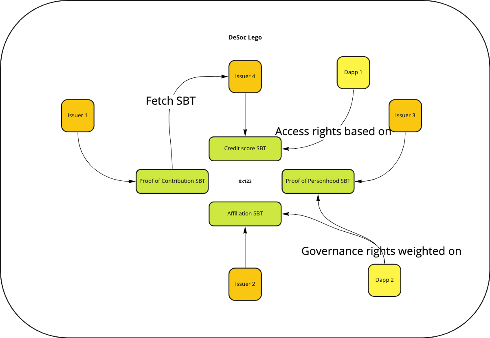

# Soul Bound Token StarterPack 

Inspired by the concept of DeSoc, this repository intends to provide builders with standard tools to create SBT and achieve DeSoc lego.

# EIP 

[EIP-4973](https://eips.ethereum.org/EIPS/eip-4973) - A standard interface for non-transferrable non-fungible tokens, also known as "account-bound" or "soulbound tokens" or "badges".

[EIP-XXXX](https://github.com/ethereum/EIPs/blob/ad528431af47054626b468edabecc0dcec91bd54/EIPS/eip-xxxx.md#abstract) - A standard interface for Name-bound Tokens (NBT). A NBT is a non-fungible token bound to a single ENS hashnode, and cannot be transferred between ENS names

# Metadata JSON Schemas 

Note: the metadata schema is not part of the EIP.

To the Desoc composability envisioned by [Vitalik, Weyl and Ohlhaver](https://papers.ssrn.com/sol3/papers.cfm?abstract_id=4105763) it is needed to create standard ways to express the data contained in a soul. 

Starting from the [ERC-721 Metadata JSON Schema standard](https://eips.ethereum.org/EIPS/eip-721) we can extend this to create more standardized way to express data. Possible data schemas may be: 

- Dao Affiliation
- Proof of Contribution
- Proof of Personhood

# Contracts 

In the contract repository you find an initial proposal on how to expand how the interfaces subject of the EIPs to create your own Soul Bound Token

# Indexers

To achieve Desoc is necessary to have indexers able to map the SBTs issued so builders can explore Desoc and:
- Make queries (Souls with DaoAffiliation to ENS DAO and with ProofOfPersonhood by ProofOfHumanity)
- Create composable experience (Guarantee voting power only to Souls that satisfy the query)
- Create scoring/reputation systems based on someone's souls
- Create reccomendation systems 
- Create curated list of souls

# Projects

- [OtterSpace](https://github.com/otterspace-xyz/otterspace-contracts)
- [Phoenix](https://github.com/phoenix-hq/erc4973-nft-collection)